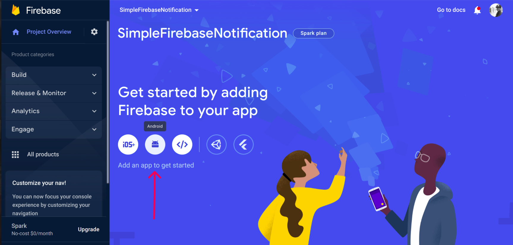
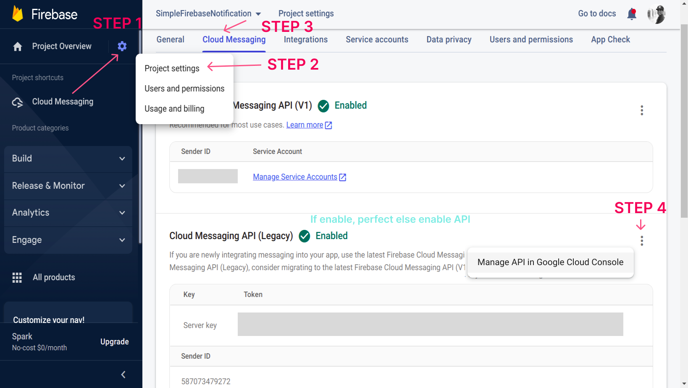
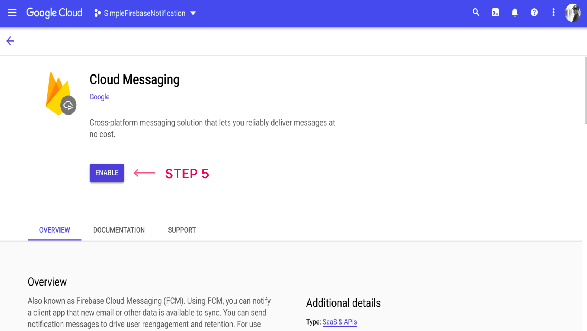
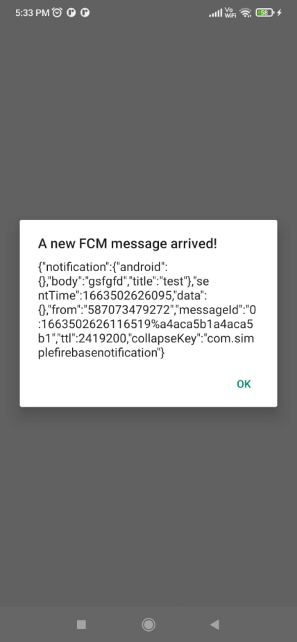
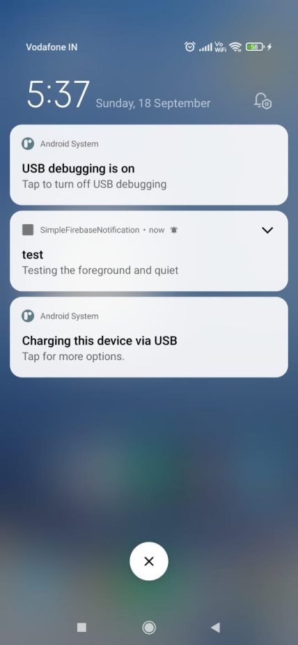

# Simple Firebase React Native Push Notification
Notifications play an important role in targeting the right users at the right time. It helps in the following ways:-
* Increasing App Engagement
* Targeting the right user
* Enhancing the conversion rate
* Engaging user retention for a period of time


**Libraries used: -**

1. **Firebase Cloud Messaging**: It is a cross-platform messaging solution that lets you reliably send messages at no cost.
2. **React Native MMKV (Optional)**: A library that allows you to easily use MMKV inside your React Native applications. We will need this if we want to store fcm token locally in a fast manner.

## What we are going to do?
Let's divide the workflow in easy steps:-
1. Setting up react native project.
2. Installing **Firebase** libraries needed for FCM Token generation and notification.
3. Integrating **React native MMKV** for fast storage. (Optional)
4. Generating FCM token and storage
5. Requesting user permission for the notification.
6. Setting up notification Listener
7. Testing

## 1. Setting up react native project.
React CLI will generate the template for you to get started quickly.

### Initialize Project
`npx react-native init SimpleReactNativeNotification`

If you are new to React Native, then follow the [React Native Official Docs](https://reactnative.dev/docs/environment-setup) to setup up the environment.

## 2. Installing Firebase libraries needed for FCM Token generation and notification.
Firebase libraries provide various method to support the firestore, real-time database firebase, Cloud messaging, and so on.

### Installing the React Native Firebase library 

```
# Using npm
npm install --save @react-native-firebase/app

# Using Yarn
yarn add @react-native-firebase/app
```

### Additional steps for setup in Android and IOS
1. Android
   Visit [Firebase console](https://console.firebase.google.com/) and start a new project.

   Add a new Android application and enter your project details. 
   

   Download the **google-services.json** file and place it inside of your project at the following location: `/android/app/google-services.json`.

   [For more info](https://rnfirebase.io/#generating-android-credentials)
2. I don't have a mac device💻. so you can follow [here](https://rnfirebase.io/#3-ios-setup) 😟

### Adding Firebase messaging libraries along with above parent library

```
# Install the messaging module

yarn add @react-native-firebase/messaging

or 

npm install --save @react-native-firebase/messaging

# If you're developing your app using iOS, run this command
cd ios/ && pod install
```

## 3. Integrating **React Native MMKV** for fast storage. (Optional)

We don't need to generate the FCM token every time, as it is the same most of the time. 

There are some exceptions, but we can handle them and reduce the number of calls to generate the token every time.

Validity of FCM Token
- The app deletes Instance ID
- The app is restored on a new device
- The user uninstalls/reinstalls the app
- The user clears app data.

### Installing

```
yarn add react-native-mmkv
or 
npm install --save react-native-mmkv

cd ios && pod install
```

### Creating instance to use throughout the app
Create a new file 'storage.js'

[storage.js](storage.js)
```
import { MMKV } from 'react-native-mmkv'

export const storage = new MMKV()
```

Hurray! Our mmkv storage is ready to use

## 4. Generate FCM token and store it
Let's write a function to generate the FCM token.

Importing the messaging library which we installed earlier  

`import messaging from '@react-native-firebase/messaging';`

### 1. Without storage  
creating a function **getFcmToken** - ['./notifications.js'](notifications.js)
```
const getFcmToken = async () => {
  try {
    const newFcmToken = await messaging().getToken();
    console.log(newFcmToken);
    return newFcmToken;
  } catch (error) {
    console.error(error);
    return null;
  }
};
```

Let's make changes in [App.js](App.js)

```
import {getFcmToken} from './notifications';

const App = () => {
  ....
  const [generatedToken, setGeneratedToken] = useState();

  useEffect(() => {
      const fetchToken = async () => {
        const token = await getFcmToken();
        if (token) {
          setGeneratedToken(token);
        }
      };
      void fetchToken();
    }, []);
  ....
}
```

### 2. With Storage
creating a function **getFcmTokenFromLocalStorage** - ['./notifications.js'](notifications.js)
```
const getFcmTokenFromLocalStorage = async () => {
  const fcmtoken = localStorage.getString('fcmtoken');
  if (!fcmtoken) {
    try {
      const newFcmToken = await messaging().getToken();
      localStorage.set('fcmtoken', newFcmToken);
    } catch (error) {
      console.error(error);
    }
  } else {
    console.log('token found', fcmtoken);
  }
};
```

Let's make changes in [App.js](App.js)

```
import {getFcmToken} from './notifications';

const App = () => {
  ....
  const fcmToken = localStorage.getString('fcmtoken');

  useEffect(() => {
      const fetchTokenByLocal = async () => {
        await getFcmTokenFromLocalStorage();
      };
      void fetchTokenByLocal();
    }, []);
  ....
}
```

Use Hooks to see the tokens
```
useEffect(() => {
  console.log('storage', fcmToken, 'newly generated', generatedToken);
}, [fcmToken, generatedToken]);
```

## 5. Requesting user permission for the notification.
iOS prevent notification unless explicitly approved by the user.

On Android, you do not need to request user permission. This method can still be called on Android devices; however, and will always resolve successfully.

In Android, we don't need any special permission for notification, but this function can still be called and will resolve successfully

['./notifications.js'](notifications.js)
```
const requestUserPermission = async () => {
  const authStatus = await messaging().requestPermission();
  const enabled =
    authStatus === messaging.AuthorizationStatus.AUTHORIZED ||
    authStatus === messaging.AuthorizationStatus.PROVISIONAL;

  if (enabled) {
    console.log('Authorization status:', authStatus);
  }
};
```

## Setting up notification Listener
We can listen for real-time FCM messages on any device.

|    **State**   |                                                                                              **Description**                                                                                              |
|:--------------:|:---------------------------------------------------------------------------------------------------------------------------------------------------------------------------------------------------------:|
| **Foreground** |                                                                      When the application is open and in view.                                                                      |
| **Background** | When the application is open, however, in the background (minimized). This typically occurs when the user has pressed the "home" button on the device or has switched to another app via the app switcher. |
| **Quit**       | When the device is locked or the application is not active or running. The user can quit an app by "swiping it away" via the app switcher UI on the device.                                                   |

You can read more about [here](https://rnfirebase.io/messaging/usage#message-handlers).

Let's Handle these three cases: -

['./notifications.js'](notifications.js)
```
const notificationListener = () => {

  messaging().onNotificationOpenedApp(remoteMessage => {
    console.log(
      'Notification caused app to open from background state:',
      remoteMessage.notification,
    );
  });

  // Quiet and Background State -> Check whether an initial notification is available
  messaging()
    .getInitialNotification()
    .then(remoteMessage => {
      if (remoteMessage) {
        console.log(
          'Notification caused app to open from quit state:',
          remoteMessage.notification,
        );
      }
    })
    .catch(error => console.log('failed', error));

  // Foreground State
  messaging().onMessage(async remoteMessage => {
    console.log('foreground', remoteMessage);
  });
};
```

For handling the Background notification, we need to add a handler at the ['./index.js'](index.js)

```
import messaging from '@react-native-firebase/messaging';

// Register background handler
messaging().setBackgroundMessageHandler(async remoteMessage => {
  console.log('Message handled in the background!', remoteMessage);
});

```

## 7. Testing
First, grab the token from the terminal generated by console.log.

Visit [TestFcm.com](https://testfcm.com/)

We need the server keys to test. We can get this from the firebase console. 

Open the project and get the server key by following the below steps:-




If your cloud messaging api is not enabled then 



## Result
### Foreground Notification


### Background and Quiet Notification


**Resources : -**
1. [Push Notification In React Native Using Firebase - Android & IOS Tutorial 2022](https://www.youtube.com/watch?v=Qcxa6dxfUFo)
2. [React Native Firebase Official Docs](https://rnfirebase.io/)

